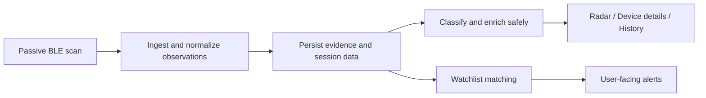

# BlueEye Tracker

<p align="center">
  <strong>Android Bluetooth/BLE observation app focused on evidence, not hype.</strong>
</p>

<p align="center">
  Observe nearby Bluetooth devices, track known devices over time, and harden the scanning pipeline step by step.
</p>

<p align="center">
  <a href="https://github.com/MichalMatu/tracker/actions/workflows/quality.yml"></a>
  <a href="https://github.com/MichalMatu/tracker/actions/workflows/gitleaks.yml"></a>
  <a href="https://github.com/MichalMatu/tracker/releases"></a>
  
  
  
  
</p>

---

## What this app is

BlueEye Tracker is an Android app for:

- passively observing nearby **Bluetooth / BLE** devices,
- recording evidence and metadata about seen devices,
- watching for reappearance of known devices,
- presenting device details, RSSI history and decoded BLE data,
- supporting a gradual, testable stabilization process.

This project is currently in a **stability recovery phase**. The code works, but product trust depends on hardening runtime behavior before new feature expansion.

> The app can surface Bluetooth evidence. It must not present unsupported claims about identity, intent, or real-world attribution from Bluetooth alone.

## Current status

- **Current branch policy:** work directly on `main`
- **Current recovery phase:** **Phase 2 — deterministic scanner/service lifecycle**
- **Last completed milestone:** **Phase 1 — BLE-only Stable Core**
- **Build/runtime standard:** **JDK 21** runtime/toolchain, **JVM 17** bytecode target

Core execution docs:

- [Stability Recovery Guide](docs/STABILITY_RECOVERY_GUIDE.md)
- [Stable Core Preimplementation Audit](docs/STABLE_CORE_PREIMPLEMENTATION_AUDIT.md)
- [Sandbox Execution Flow](docs/SANDBOX_EXECUTION_FLOW.md)
- [Quality Gate](docs/QUALITY_GATE.md)

## Install BlueEye Tracker

### Tester build — persistent download

Versioned tester APKs are published under **GitHub Releases** and do not expire like CI artifacts.

- [Download the latest tester release](https://github.com/MichalMatu/tracker/releases)

Release assets are named like:

- `BlueEye-Tracker-vX.Y.Z-...-debug.apk`
- matching `.sha256` checksum

> Current releases are **debug-signed tester builds**, not production-signed Play Store releases. Installing over an APK signed with another debug key may require uninstalling the previous build first.

### Latest CI build — exact commit snapshot

Every successful `main` build also publishes short-lived GitHub Actions artifacts:

1. Open [Quality workflow runs](https://github.com/MichalMatu/tracker/actions/workflows/quality.yml)
2. Open the newest successful run on `main`
3. Scroll to **Artifacts**
4. Download:
   - `tracker-debug-<SHA>` — debug APK
   - `tracker-source-<SHA>` — exact source snapshot used by CI

Use **Releases** for normal tester downloads and **Actions artifacts** when you need a build tied to one exact commit SHA.

## Project flow



## Stabilization strategy

The project is intentionally being recovered in phases.

1. **Phase 1 — BLE-only Stable Core** ✅
2. **Phase 2 — deterministic scanner/service lifecycle**
3. **Phase 3 — ingest pressure, queueing and drop visibility**
4. **Phase 4 — alert ownership and cancellation**
5. **Phase 5 — identity and deduplication hardening**
6. **Phase 6 — Radar/history semantics and diagnostics**
7. **Phase 7 — physical-device validation**
8. **Phase 8 — controlled reintroduction of advanced features**

The canonical checklist lives in [docs/STABILITY_RECOVERY_GUIDE.md](docs/STABILITY_RECOVERY_GUIDE.md).

## Architecture at a glance

```text
app            Android entrypoint, navigation, Hilt wiring
core:model     shared models
core:domain    contracts and use cases
core:data      Room, scanning, scanner service, tracking/session logic
core:decoders  BLE manufacturer/service decoders
core:ui        shared Compose UI layer
feature:*      screens and feature ViewModels
```

More detail: [docs/ARCHITECTURE_CURRENT.md](docs/ARCHITECTURE_CURRENT.md)

## Local development

### Requirements

- Android Studio / command-line Android tooling
- **JDK 21**
- Android SDK matching the project configuration

### Common commands

```bash
./gradlew qualityCheck
./gradlew :app:assembleDebug
```

Local secret scan:

```bash
gitleaks git --config .gitleaks.toml --redact --verbose
```

## Engineering workflow

During stabilization, workers are used by role:

- **ChatGPT sandbox** — static analysis, patch preparation, offline Android/JVM builds
- **GitHub Actions** — canonical CI, APK publishing, source snapshots, dependency/network work
- **Local Agent / Mac** — ADB, physical device testing, lock-screen/Bluetooth runtime evidence

Reference: [docs/SANDBOX_EXECUTION_FLOW.md](docs/SANDBOX_EXECUTION_FLOW.md)

## Contributing

Contributions are welcome, but this repository is currently operated under a **stability-first** rule set.

Before opening a PR, please read:

- [CONTRIBUTING.md](CONTRIBUTING.md)
- [docs/STABILITY_RECOVERY_GUIDE.md](docs/STABILITY_RECOVERY_GUIDE.md)
- [docs/QUALITY_GATE.md](docs/QUALITY_GATE.md)

Short version:

- keep changes small and testable,
- do not mix recovery phases,
- do not broaden scope without updating the recovery guide,
- keep claims evidence-based,
- always leave the project in a buildable state.

## Documentation index

- [Product Goal](docs/PRODUCT_GOAL.md)
- [Architecture](docs/ARCHITECTURE_CURRENT.md)
- [Pipeline Audit](docs/PIPELINE_AUDIT.md)
- [Detection Confidence](docs/DETECTION_CONFIDENCE.md)
- [Evidence Model](docs/EVIDENCE_MODEL.md)
- [Stability Recovery Guide](docs/STABILITY_RECOVERY_GUIDE.md)
- [Stable Core Preimplementation Audit](docs/STABLE_CORE_PREIMPLEMENTATION_AUDIT.md)
- [Sandbox Execution Flow](docs/SANDBOX_EXECUTION_FLOW.md)
- [Quality Gate](docs/QUALITY_GATE.md)

## License

No license file is currently present in the repository. Until one is added, reuse rights are not explicitly granted.
