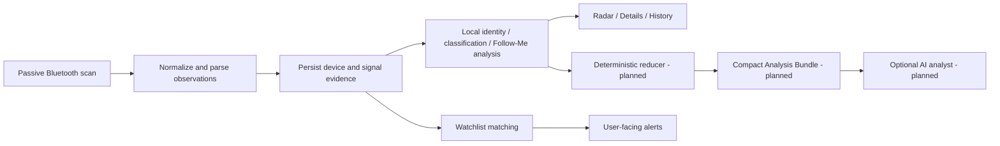

# BlueEye Tracker

<p align="center">
  <strong>Android Bluetooth/BLE situational-awareness app focused on evidence, local analysis and explainable decisions.</strong>
</p>

<p align="center">
  Observe nearby Bluetooth devices, track meaningful patterns over time, keep raw evidence inspectable, and reduce RF noise before deeper analysis.
</p>

<p align="center">
  <a href="https://github.com/MichalMatu/tracker/actions/workflows/quality.yml"></a>
  <a href="https://github.com/MichalMatu/tracker/actions/workflows/gitleaks.yml"></a>
  <a href="https://github.com/MichalMatu/tracker/actions/workflows/android-ui-smoke.yml"></a>
  <a href="https://github.com/MichalMatu/tracker/releases/tag/latest-tester"></a>
  
  
  
</p>

---

## What this app is

BlueEye Tracker is an Android app for:

- passively observing nearby **Bluetooth / BLE** devices,
- recording signal history and evidence about observations,
- watching for reappearance of known devices,
- detecting repeated presence across time and confirmed movement without claiming certainty about intent,
- inspecting RSSI history, identity/evidence context and decoded Bluetooth data,
- progressively reducing noisy field data into a small number of meaningful, explainable candidates.

> The app can surface Bluetooth evidence and behavioral patterns. It must not present unsupported claims about a person's identity, malicious intent, ownership, exact device location, or real-world attribution from Bluetooth alone.

## Current status

- **Accepted baseline:** `main`
- **Phase 3 field reacceptance:** **ACCEPTED / CLOSED**
- **Phase 4:** **UNBLOCKED**
- **Current workstream:** Radar + Details UX/performance redesign
- **Current redesign branch:** `ui/radar-details-redesign`
- **Build/runtime standard:** JDK 21 runtime/toolchain, JVM 17 bytecode target

The final authoritative Phase 3 closure is:

- [Phase 3 Final Field Reacceptance Closure](docs/PHASE3_FIELD_REACCEPTANCE_CLOSURE_2026-09-11.md)

The active implementation roadmap is:

- [UI/UX Redesign and Analysis Pipeline Plan](docs/UI_UX_REDESIGN_PLAN.md)

For the complete current-vs-historical documentation map, start at:

- [Documentation Index](docs/README.md)

## Product direction

The project is deliberately local-first:

```text
Bluetooth observations
  -> deterministic parsing
  -> local noise reduction / identity / encounters / movement / RSSI summaries
  -> explainable local candidates and verdict
  -> optional compact Analysis Bundle
  -> optional AI analyst for ambiguous multi-signal reasoning
```

Collection, persistence, parsing and baseline detection must work without cloud or AI access. The intended future AI mode receives a reduced, versioned evidence bundle rather than an unrestricted raw database dump, and its assessment remains separate from the local verdict.

See [Product Goal](docs/PRODUCT_GOAL.md) for the product and claim boundaries.

## Current UX work

The current redesign follows progressive disclosure:

- **Radar:** compact identity, RSSI/freshness and attention state; no default technical dump.
- **Details:** decision summary first, then Tracking & Signal, key evidence and identity.
- **Technical Peek:** UUIDs, manufacturer data, PHY/GATT and raw advertisement remain accessible but collapsed by default.
- **RSSI history:** retained as a first-class Details visualization.
- **Sightings map:** planned per-device view using observation GPS/accuracy; it represents where the phone observed a signal, not exact device location.

The detailed checklist and acceptance gates live in [docs/UI_UX_REDESIGN_PLAN.md](docs/UI_UX_REDESIGN_PLAN.md).

## Project flow



## Architecture at a glance

```text
app            Android entrypoint, navigation, Hilt wiring
core:model     shared models
core:domain    contracts and use cases
core:data      Room, scanning, scanner service, tracking/session logic
core:decoders  BLE manufacturer/service decoders
core:ui        shared Compose UI layer
feature:*      screens and feature ViewModels
```

More detail: [docs/ARCHITECTURE_CURRENT.md](docs/ARCHITECTURE_CURRENT.md)

## Install BlueEye Tracker

### Tester build

A rolling tester APK is refreshed after successful canonical build/release automation on `main`.

- [Latest tester release](https://github.com/MichalMatu/tracker/releases/tag/latest-tester)
- [All releases](https://github.com/MichalMatu/tracker/releases)
- [Release and artifact conventions](docs/RELEASES_AND_ARTIFACTS.md)

Current tester/recovery builds are engineering/debug builds unless a release explicitly states otherwise. APKs signed with different debug keys may not be installable over one another without preserving data and handling the signing mismatch deliberately.

Historical Phase 3 pre-field releases are retained as test provenance; they are **not** the current source of truth for field acceptance.

### Exact CI snapshot

Successful canonical builds can publish commit-tied GitHub Actions artifacts such as a debug APK and exact source snapshot. Use those artifacts when reproducing one exact source SHA; use the tester release for ordinary testing.

## Local development

### Requirements

- Android Studio / command-line Android tooling
- **JDK 21**
- Android SDK matching the project configuration

### Common commands

```bash
./gradlew qualityCheck
./gradlew :app:assembleDebug
```

Local secret scan:

```bash
gitleaks git --config .gitleaks.toml --redact --verbose
```

## Engineering workflow

Repository work is stability- and evidence-first:

- `main` is the accepted baseline.
- Substantial work happens on a dedicated branch and returns through review/CI.
- GitHub Actions is the canonical networked CI/publication authority.
- Local Agent / Mac is used for deterministic local commands, ADB and physical-device evidence.
- Sensitive field telemetry (exact GPS, MACs, Room/WAL/SHM, HCI snoop, bugreports and raw private captures) must not be committed.

Reference: [docs/SANDBOX_EXECUTION_FLOW.md](docs/SANDBOX_EXECUTION_FLOW.md)

## Documentation

Start with [docs/README.md](docs/README.md). It explicitly separates active plans and current references from historical stabilization provenance.

Key current documents:

- [Product Goal](docs/PRODUCT_GOAL.md)
- [UI/UX Redesign and Analysis Pipeline Plan](docs/UI_UX_REDESIGN_PLAN.md)
- [Architecture](docs/ARCHITECTURE_CURRENT.md)
- [Pipeline Audit](docs/PIPELINE_AUDIT.md)
- [Evidence Model](docs/EVIDENCE_MODEL.md)
- [Detection Confidence](docs/DETECTION_CONFIDENCE.md)
- [Quality Gate](docs/QUALITY_GATE.md)
- [Sandbox Execution Flow](docs/SANDBOX_EXECUTION_FLOW.md)
- [Phase 3 Final Closure](docs/PHASE3_FIELD_REACCEPTANCE_CLOSURE_2026-09-11.md)

## Contributing

Contributions should remain small, testable and evidence-based. Do not broaden scanner/parser/scoring behavior as an incidental part of UI work, and do not make stronger user-facing claims than the collected evidence supports.

Before a substantial change, read:

- [CONTRIBUTING.md](CONTRIBUTING.md)
- [docs/README.md](docs/README.md)
- [docs/QUALITY_GATE.md](docs/QUALITY_GATE.md)

## License

No license file is currently present in the repository. Until one is added, reuse rights are not explicitly granted.
