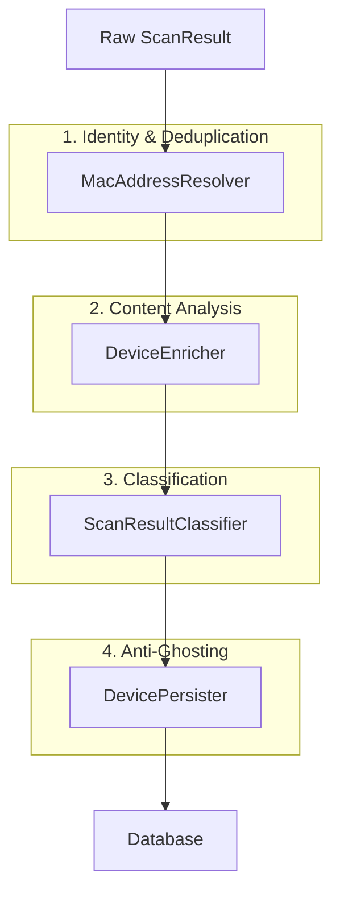

# Logic Analysis: BLE Parsing, Enrichment & Deduplication

This document details the analysis pipeline for Bluetooth Low Energy (BLE) signals in the BlueEye Tracker project. It covers how raw bytes are transformed into meaningful device data and how the system prevents duplication.

---

## 1. Analysis Pipeline Overview

The analysis process follows a linear pipeline, orchestrated by `BleScanHandler`.



---

## 2. Passive Analysis (Scanning)

Passive analysis occurs on every received advertisement packet without connecting to the device.

### 2.1 Packet Parsing (`BlePacketAnalyzer`)
The system strips the raw byte array into standard **AD Structures** (Length-Type-Value).

**File:** `core/data/src/main/java/io/blueeye/core/scanner/analysis/BlePacketAnalyzer.kt`

**How it works:**
It iterates through the byte array, identifying standard types like:
- `0x01` Flags
- `0xFF` Manufacturer Specific Data
- `0x09` Complete Local Name
- `0x02` - `0x07` Service UUIDs

**Code Example:**
```kotlin
fun analyze(scanRecord: ByteArray?): String {
    // ... iteration loop ...
    val type = scanRecord[index + 1].toInt()
    val data = scanRecord.copyOfRange(index + 2, nextIndex)

    return when (type) {
        BleAdTypes.FLAGS -> BleCommonDataParser.parseFlags(data)
        BleAdTypes.MANUFACTURER_SPECIFIC -> BleManufacturerDataParser.parse(data) // -> Delegated to specific parsers
        else -> "HEX: " + data.toHex()
    }
}
```

### 2.2 Vendor Enrichment (`VendorEnricher`)
Once Manufacturer Data is extracted (e.g., Company ID `0x004C` for Apple), the `VendorEnricher` delegates deeper analysis to specific strategies.

**File:** `core/data/src/main/java/io/blueeye/core/data/repository/handler/ble/enricher/VendorEnricher.kt`

**Mechanism:**
It uses a `VendorStrategyFactory` to find a matching decoder for the Company ID.

**Example Strategies:**
- **Apple (`0x004C`)**: Decodes AirTags, AirPods, FindMy, iBeacons.
- **Samsung (`0x0075`)**: Decodes SmartTags, Buds.
- **Microsoft (`0x0006`)**: Decodes Swift Pair beacons.

**Code Logic:**
```kotlin
// In VendorEnricher.kt
val vendorResult = vendorStrategyFactory.decode(
    ctx.manufacturerId,
    ctx.manufacturerData, // e.g., payload without company ID
    ctx.serviceUuids
)

if (vendorResult != null) {
    ctx.vendorModel = vendorResult.modelName  // e.g., "AirPods Pro"
    ctx.vendorDeviceType = vendorResult.deviceType // e.g., WEARABLE
}
```

---

## 3. Explicit Active Analysis

Passive scanning is the default. Active GATT analysis is only performed when the user explicitly
opens device details and uses the connection control.

**File:** `core/data/src/main/java/io/blueeye/core/connectivity/manager/BleConnectionManager.kt`

### 3.1 GATT Service Discovery
The connection flow can read standard characteristics:
- **Device Information Service (0x180A)**:
    - Model Number String (`0x2A24`)
    - Serial Number String (`0x2A25`)
    - Firmware Revision (`0x2A26`)
    - Manufacturer Name (`0x2A29`)
- **Battery Service (0x180F)**:
    - Battery Level (`0x2A19`)

### 3.2 Probe Result Handling
The collected data is updated in the database, permanently enriching the device record even if it only broadcasts generic data later.

---

## 4. Deduplication Logic

One of the most complex parts is handling **MAC Address Randomization**.

### 4.1 Address Carryover (`MacAddressResolver`)
Many modern devices rotate their MAC address every 15 minutes. To avoid showing 4 different "devices" for the same physical object in an hour, the system uses **Address Carryover**.

**File:** `core/data/src/main/java/io/blueeye/core/data/repository/handler/ble/MacAddressResolver.kt`

**Logic:**
1.  **Analyze Privacy:** Checks if the MAC is Random (`analyzeMacType`).
2.  **Match Payload:** Uses `AddressCarryoverTracker` to compare the new signal's payload (e.g., cryptographic hash, specific manufacturer data pattern) with recent known devices.
3.  **Carryover:** If a strong match is found, the **Fingerprint** (primary ID) is maintained, even if the MAC address changed.

```kotlin
// In MacAddressResolver.kt
if (ctx.macAddressType == MacAddressType.RANDOM) {
    val correlation = addressCarryoverTracker.processScan(ctx.scanData)
    
    if (correlation.isMatch) {
         // Use the OLD MAC as the identifier (Fingerprint), merging this new signal into the old device
        ctx.fingerprint = correlation.correlatedMac 
        Log.w(TAG, "MAC CARRYOVER: ${ctx.mac} -> ${ctx.fingerprint}")
    }
}
```

### 4.2 Anti-Ghosting (`DevicePersister`)
Sometimes a heuristic fails temporarily, creating a "Ghost" duplicate. The `DevicePersister` has a self-healing mechanism.

**File:** `core/data/src/main/java/io/blueeye/core/data/repository/handler/ble/DevicePersister.kt`

**Logic:**
If we decide that MAC `B` is actually Device `A` (via carryover), we verify if a separate row for `B` already exists in the database. If it does, we **merge** it into `A` immediately.

```kotlin
// In DevicePersister.kt (Anti-Ghosting)
if (ctx.mac != ctx.fingerprint) {
    val ghost = deviceDao.getByFingerprint(ctx.mac)
    if (ghost != null) {
        // Merge the accidental ghost back into the main record
        deviceDao.mergeDevices(target = ctx.fingerprint, source = ctx.mac)
    }
}
```

### 4.3 Name Protection
To prevent generic names like "Ble Device" or "Find My" from overwriting specific discovered names (e.g., "Michal's MacBook"), the persister uses `resolveBestName`.

```kotlin
private fun resolveBestName(current: String?, candidate: String?): String? {
    // If candidate is generic (e.g., "Apple Device"), DON'T overwrite specific name (e.g., "Michal's AirTag")
    if (isGenericName(candidate) && !isGenericName(current)) {
        return current
    }
    return candidate
}
```

---

## 5. Summary of Available Tools

| Component | Responsibility | Key Files |
| :--- | :--- | :--- |
| **Packet Analyzer** | Raw bytes → Generic Structure | `BlePacketAnalyzer.kt` |
| **Vendor Enricher** | Manufacturer ID → Specific Model | `VendorEnricher.kt`, `VendorStrategyFactory.kt` |
| **MAC Resolver** | Random MAC → Persistent ID | `MacAddressResolver.kt`, `AddressCarryoverTracker.kt` |
| **Device Persister** | DB Updates, Anti-Ghosting, Throttling | `DevicePersister.kt`, `ScanThrottler.kt` |
| **Explicit GATT Connection** | User-triggered GATT connection → services/characteristics | `BleConnectionManager.kt`, `BleGattClient.kt` |

## 6. System Flow Implementation (v2.4)

With the introduction of **Smart Merge**, **Active Retention**, and **Visual Persistence**, the system now follows a strict lifecycle for every device.

### 6.1 The "Life and Death" Cycle

1.  **Birth (0s)**:
    *   An advertisement is received.
    *   If correlated via **Smart Merge** (), it merges into an existing ID.
    *   If not, a NEW device entry is created.
    *   **UI**: Shows device with **Standard Color** (White/Gray). User perceives it as "Candidate".

2.  **Survival (0s - 180s)**:
    *   The device must continue to emit signals (at least once per 180s).
    *   Every signal updates `lastSeenAt`.
    *   `firstSeenAt` remains unchanged (birth time).

3.  **Confirmation (3 min / 180s)**:
    *   **The Filter**: If the device falls silent for > 180s, the **Garbage Collector** () deletes it from the DB. Use **Watchlist** (Heart Icon) to protect rare beacons from deletion.
    *   **The Reward**: If the device keeps emitting, it crosses the 180s threshold.
    *   **UI**: The Device Name turns **GREEN**.
    *   **Meaning**: "This device is physically persistent and verified."

### 6.2 Strengths
*   **Anti-Stalking**: A following device (e.g., hidden tag) that rotates its MAC address every 15 minutes will remain **GREEN** continuously, because Smart Merge maintains the identity while the MAC changes. You see one green entry, not a trail of white ghosts.
*   **Database Hygiene**: The database never grows indefinitely. Transient devices (passing cars, random noise) are wiped after 3 minutes.
*   **Visual Clarity**: The user doesn't need to check timestamps. Green = Trusted/Persistent. White = Noise/New.

### 6.3 Weaknesses & Mitigations
*   **Silent Beacons**: Devices broadcasting > 3 minutes (e.g., anti-theft tags in sleep mode) will be deleted and reappear as New (White).
    *   *Mitigation*: User must manually **Watchlist** these devices to prevent deletion.
*   **Merge Failure**: If a device rotates MAC and the heuristic fails (e.g., missed packets), it creates a NEW entry. The Green indicator resets.
    *   *Mitigation*: The "Shadow Match" heuristic uses RSSI + Time proximity to catch these, even if payload changes.
*   **Battery Impact**: Continuous scanning is required to maintain the "Green" status (keep updating `lastSeenAt`).
    *   *Mitigation*: Foreground Service ensures stability, but consumes power.
