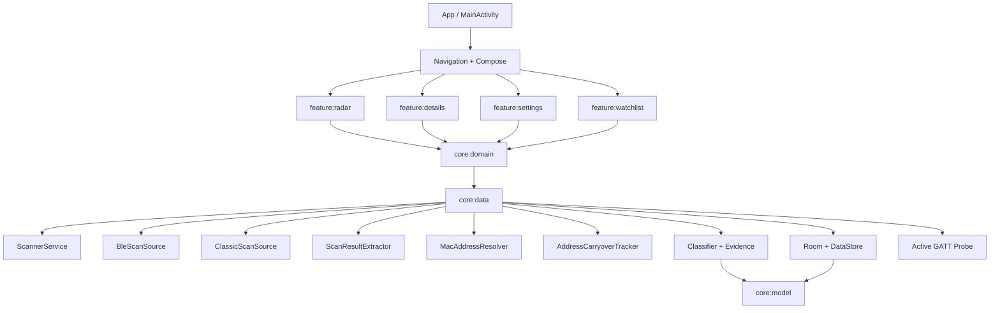
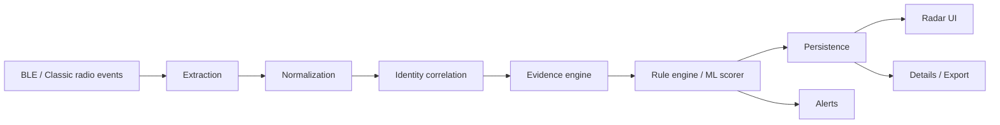
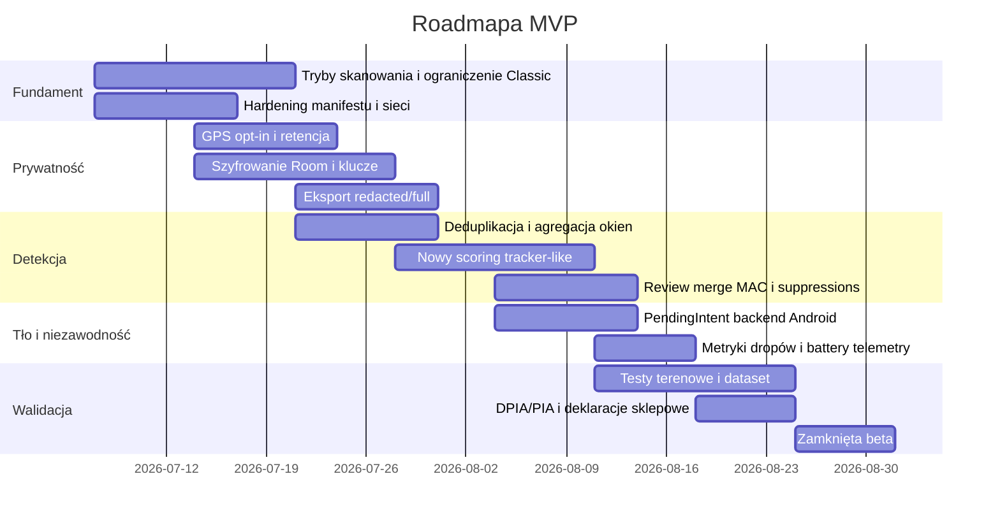

# Audyt aplikacji mobilnej BLE do wykrywania śledzenia i sygnałów kamer nasobnych

## Podsumowanie wykonawcze

Po przeglądzie dostarczonego archiwum źródłowego widać, że badany projekt jest obecnie **aplikacją Androidową** napisaną w Kotlinie, z modułami `app`, `core:*` i `feature:*`; w archiwum nie ma projektu iOS, więc wnioski dla iPhone’a/iPada mają charakter architektoniczny i projektowy, a nie wynikają z inspekcji gotowego kodu iOS. Sam Androidowy rdzeń jest już dość rozbudowany: ma skanowanie BLE i Bluetooth Classic, foreground service, Room, DataStore, listę obserwowanych urządzeń, eksport sesji oraz warstwę „evidence/confidence”, czyli świadomą próbę nieprzesadzania z twierdzeniami. To jest dobry fundament na **narzędzie świadomości sytuacyjnej**, ale jeszcze nie na produkt, który mógłby wiarygodnie obiecywać wykrywanie „czy ktoś mnie śledzi” albo „czy kamera Axon właśnie nagrywa”. W tej postaci aplikacja jest raczej **detektorem sygnałów radiowych i wzorców zachowania urządzeń**, nie detektorem intencji ludzi. To rozróżnienie jest krytyczne technicznie, prawnie i etycznie. citeturn2search5turn9search2turn9search0turn9search1

Najpoważniejsze problemy obecnej implementacji Androidowej są konkretne i naprawialne. Najważniejsze to: stały skan `SCAN_MODE_LOW_LATENCY`, brak trybów energetycznych i brak polityki adaptacyjnej; skan w tle oparty na `ScanCallback`, a nie na `PendingIntent`, więc zależny od życia procesu; uruchomiony równolegle loop Bluetooth Classic; utrzymywanie `WakeLock`; aktywne pobieranie lokalizacji i zapisywanie współrzędnych GPS do próbek sygnału; lokalna baza Room bez szyfrowania; `android:allowBackup="true"` i `android:usesCleartextTraffic="true"`; oraz algorytmy śledzenia oparte głównie na heurystykach RSSI/MAC/payload, które są podatne na szum, środowisko radiowe, randomizację adresów i świadome obchodzenie detekcji. Dokumentacja Androida jasno pokazuje, że model uprawnień Bluetooth i zachowanie pracy w tle zmieniały się między wersjami, a dla skanów w tle zalecane są inne mechanizmy niż długowieczny callback w procesie aplikacji. citeturn1search0turn6search4turn6search8turn1search8turn12search0turn12search20

Najważniejszy wniosek produktowy jest jeszcze ostrzejszy: **BLE samo w sobie zwykle nie wystarcza do wnioskowania, że kamera nasobna jest aktywna i nagrywa**. Oficjalne materiały Axon potwierdzają istnienie parowania Bluetooth z aplikacją Axon View oraz „Axon Signal”, które bezprzewodowo wyzwala nagrywanie pobliskich kamer, ale nie dają publicznej podstawy, by twierdzić, że dowolny telefon trzeciej strony może niezawodnie odczytać z eteru stan „recording on/off”. Dlatego w MVP kategoria „kamera aktywna” nie powinna istnieć jako twarda etykieta; bezpieczniejsza semantyka to **„sygnał zgodny z urządzeniem profesjonalnym / public-safety-like”** albo **„sygnał zgodny z ekosystemem Axon”**, z jawnym poziomem ufności i źródłami dowodu. citeturn2search4turn2search5turn2search7turn2search0

Rekomendowany kierunek do MVP jest więc dwuetapowy. Najpierw produkt powinien stać się **lokalnym, prywatnościowym skanerem BLE** z trzema klasami wyników: „znane urządzenie z watchlisty”, „nieznane urządzenie trackeropodobne poruszające się z użytkownikiem”, „urządzenie profesjonalne / kameraopodobne / sensory ekosystemowe”. Dopiero później, po zebraniu oznaczonych danych i walidacji terenowej, można dodawać model sekwencyjny i lepszą korelację randomizowanych MAC-ów. W praktyce oznacza to: twardszą architekturę danych, prostszy i bardziej jawny silnik reguł na start, adaptacyjne skanowanie, szyfrowanie bazy, ograniczenie GPS do jawnej sesji testowej, DPIA/PIA, testy polowe oraz osobny plan dla iOS, bo Core Bluetooth ma inne ograniczenia tła, filtrów i przywracania stanu niż Android. citeturn7search1turn7search0turn7search2turn9search2turn5search0turn4search12

## Zakres i założenia audytu

Ten raport łączy dwie perspektywy. Pierwsza to **inspekcja dostarczonego kodu Android** i dokumentacji projektu. Druga to **źródła oficjalne i pierwotne** dotyczące Androida, iOS, Bluetooth SIG, mechanizmów wykrywania niechcianych trackerów, prywatności oraz ochrony danych. Dzięki temu można odróżnić to, co rzeczywiście robi obecny kod, od tego, co wolno lub czego nie wolno obiecywać na współczesnych wersjach systemów mobilnych. citeturn1search0turn6search4turn7search1turn3search0turn9search2

Najważniejsze ograniczenie jest proste: w archiwum nie ma kodu iOS. Dlatego część iOS obejmuje tylko **zalecany projekt referencyjny**: `CoreBluetooth`, tryb tła `bluetooth-central`, `NSBluetoothAlwaysUsageDescription`, sprawdzanie `CBManagerAuthorization` oraz state restoration. Apple dopuszcza BLE w tle, ale wymaga odpowiedniej konfiguracji i inaczej traktuje skanowanie z duplikatami, filtry i przywracanie stanu niż Android. To oznacza, że nie należy zakładać pełnej równoważności feature-for-feature między platformami. citeturn1search2turn1search3turn7search0turn7search1turn7search2turn7search12

Drugie ograniczenie dotyczy samego problemu domenowego. Oficjalne rozwiązania Apple/Google do wykrywania niechcianego śledzenia są ukierunkowane na **trackery lokalizacyjne zgodne z branżową specyfikacją** i wykorzystują mechanizmy systemowe oraz wiedzę producentów urządzeń. To bardzo ważny punkt odniesienia: aplikacja trzeciej strony może być wartościowa jako radar ekspercki, ale nie powinna twierdzić, że zastępuje systemowe alerty „unknown tracker”. Wręcz przeciwnie, powinna je traktować jako referencyjny kanał bezpieczeństwa użytkownika. citeturn9search0turn9search1turn9search2turn9search17

Trzecie ograniczenie dotyczy prawa i etyki. Adresy MAC, identyfikatory online, dane lokalizacyjne i historia współwystępowania urządzeń mogą stanowić dane osobowe albo przynajmniej dane umożliwiające identyfikację pośrednią; RODO wymienia wprost identyfikatory online i dane lokalizacyjne, a UODO wskazuje, że przetwarzanie nowych technologii o wysokim ryzyku może wymagać oceny skutków dla ochrony danych. Tu nie da się oprzeć produktu wyłącznie na haśle „to tylko radio”. citeturn5search0turn5search6turn5search7turn4search12turn4search15

## Architektura, dane i UX

Na podstawie przeglądu archiwum projekt ma dziś sensowny układ warstw: `app` uruchamia aplikację i nawigację, `core:data` obsługuje skanowanie, bazę Room, foreground service, klasyfikację i logikę sesji, `core:domain` trzyma kontrakty i use case’y, `core:model` modele domenowe, a moduły `feature:*` realizują ekrany Radar/Details/Settings/Watchlist. To dobra podstawa do dalszego „utwardzania”, ale jednocześnie znak, że obecne `core:data` jest zbyt szerokie i z czasem będzie trudne do testowania i wydzielania odpowiedzialności.

Najważniejszy przepływ danych jest dziś taki: telefon skanuje BLE i Bluetooth Classic, wynik przechodzi przez ekstrakcję pól reklamy, resolver adresów MAC, heurystyki korelacji, klasyfikację i scoring „Follow-Me”, następnie stan urządzenia i próbki sygnału trafiają do Room, a UI pokazuje sekcje Radar/Details/Watchlist. Architektonicznie to już coś więcej niż zwykły „sniffer” — to lokalny pipeline obserwacji i interpretacji. Technicznie jest to właściwy kierunek, bo użytkownik potrzebuje nie tylko listy reklam BLE, ale odpowiedzi „co to może być i dlaczego tak sądzimy”. Jednocześnie platformy mobilne mocno ograniczają, co da się robić niezawodnie w tle i z jaką częstotliwością; Android sugeruje dla tła skan przez `PendingIntent`, a nie wyłącznie procesowy `ScanCallback`, natomiast iOS wymaga odpowiedniej konfiguracji tła oraz state restoration. citeturn6search4turn6search8turn1search8turn7search1turn7search0turn7search12

W przeglądzie kodu Androida szczególnie rzucają się w oczy następujące zachowania architektoniczne: foreground service z `WakeLock`, BLE skan uruchamiany w trybie `SCAN_MODE_LOW_LATENCY`, brak trybów adaptacyjnych, zerowy `reportDelay`, równoległy loop Bluetooth Classic oraz kanał zdarzeń z pojemnością 4096 i polityką `DROP_OLDEST`. Dla prototypu to zrozumiałe, bo daje maksymalną obserwowalność. Dla produktu terenowego oznacza jednak duże ryzyko trzech rzeczy naraz: drenowania baterii, przepełniania kolejki i „cichych” false negative przy dużym zagęszczeniu eteru. Android wprost opisuje `SCAN_MODE_LOW_LATENCY` jako najwyższy duty cycle, a dokumentacja tła podkreśla, że długowieczne BLE w tle wymaga innych mechanizmów niż zwykłe callbacki. citeturn1search1turn1search5turn6search4turn6search8turn6search2

Warstwa UI/UX jest akurat stosunkowo dojrzała jak na ten typ aplikacji. Podział na sekcje „Watchlist”, „Suspicious”, „Public Safety Signals”, „Nearby” i „Unknown / Noise” jest sensowny, bo separuje użyteczne sygnały od tła i szumu. Najmocniejszą stroną projektu jest obecność modelu „evidence + confidence”, bo to ogranicza ryzyko nadinterpretacji: użytkownik ma zobaczyć nie tylko etykietę, ale także powód, źródło (reklama BLE, SDP, aktywny GATT, analiza RSSI) i poziom pewności. To jest zgodne z dobrymi praktykami także na poziomie OS-owym: zarówno Apple, jak i Google budują własne powiadomienia o niechcianych trackerach tak, by były ostrożne, kontekstowe i nastawione na bezpieczeństwo, a nie na kategoryczne oskarżenia. citeturn9search0turn9search1turn9search2

Dla iOS rekomendowana architektura referencyjna powinna wyglądać inaczej niż aktualny Android. Należy użyć `CBCentralManager` z osobną kolejką serialną, state restoration (`CBCentralManagerOptionRestoreIdentifierKey`), sprawdzania autoryzacji przez `CBManagerAuthorization`, wpisu `NSBluetoothAlwaysUsageDescription` oraz trybu tła `bluetooth-central`. W tle iOS ogranicza zachowanie skanowania, a przywracanie stanu staje się kluczowe dla odporności na ubijanie procesu. To oznacza, że wspólna logika klasyfikacji może być multiplatformowa, ale warstwa skanowania i harmonogramów musi być per-platform. citeturn1search3turn7search0turn7search1turn7search2turn7search12

## Słabe punkty i plan naprawczy

Poniższa tabela wskazuje **konkretne słabości**, miejsca w projekcie, ich znaczenie i rekomendowaną naprawę. To jest najważniejsza część auditowa, bo z niej wynika plan dojścia do MVP.

| Priorytet | Słabość | Gdzie | Dlaczego to ma znaczenie | Jak naprawić |
|---|---|---|---|---|
| P0 | Stały `SCAN_MODE_LOW_LATENCY` i `reportDelay=0` | `core/.../scanner/source/BleScanSource.kt` | Maksymalizuje wykrywalność, ale bardzo podnosi koszt baterii i CPU, szczególnie z foreground service i Classic loop; to niepotrzebne poza krótkimi oknami wysokiej uwagi. Android dokumentuje, że `LOW_LATENCY` to najwyższy duty cycle. citeturn1search1turn1search5 | Wprowadzić politykę skanowania: `LOW_POWER` w tle, `BALANCED` w sesji normalnej, `LOW_LATENCY` tylko w 15–60 s po wejściu w ekran Radar lub po wykryciu silnego kandydata. Dodać scheduler: 20 s scan / 40 s idle dla tła Android. |
| P0 | Skan w tle zależy od procesu aplikacji | `BleScanSource.startScan(..., ScanCallback)` oraz `ScannerService` | Gdy proces zostanie ubity, callback znika. Android zaleca `PendingIntent` jako metodę skanowania, gdy proces nie jest stale żywy. citeturn6search4turn6search8 | Dodać drugi backend skanera: `BluetoothLeScanner.startScan(filters, settings, pendingIntent)`. Tryb „background-safe” ma używać filtrów i receivera; tryb „interactive” może zostać na callbackach. |
| P0 | Równoległy loop Bluetooth Classic | `ClassicScanSource.kt`, `BleScanner.startClassicDiscovery()` | Classic discovery jest ciężkie energetycznie i może pogarszać współdzielenie radia z BLE; w aplikacji nastawionej na reklamę BLE wnosi koszt większy niż zysk. | Wyłączyć Classic w MVP domyślnie. Zostawić tylko ręczny przełącznik diagnostyczny „Classic enrichment”. Uruchamiać sporadycznie, np. 30 s co 10 min albo tylko na ekranie Details. |
| P0 | `WakeLock` i foreground service bez adaptacji | `ScannerService.kt` | Zwiększa odporność na usypianie, ale przy ciągłym skanie może produkować duży koszt baterii i ryzyko irytacji użytkownika. Android 14+ dodatkowo porządkuje typy FGS i sugeruje rozważenie innych API do skanu BT. citeturn1search8turn6search5 | Zostawić FGS tylko dla „Active session”, dodać licznik zużycia energii i automatyczne wygaszenie sesji. `WakeLock` ograniczyć do krótkich okien krytycznych, nie całej sesji. |
| P0 | Zapisywanie GPS do każdej próbki sygnału | `LocationProvider.kt`, `SignalSampleEntity.kt`, `DevicePersister.recordSignalSampleDirect()` | To ogromnie zwiększa wrażliwość danych. GPS + MAC + czas + seriale z GATT to profil osobowy wysokiego ryzyka pod RODO. Użytkownik często tego nie potrzebuje do samego wykrycia śledzenia. citeturn5search0turn5search6turn4search12 | Domyślnie wyłączyć GPS. Włączyć tylko w trybie badawczym/sesji testowej z osobnym consent screen. Dodać retencję i możliwość „export without location”. |
| P0 | Room bez szyfrowania | `TrackerDatabase`, brak integracji szyfrowania | Lokalnie przechowywane są identyfikatory, historia współobecności, lokalizacja, surowe payloady i potencjalnie seriale. To dane o wysokiej wrażliwości operacyjnej. | Zintegrować SQLCipher z Room przez `SupportFactory` / `SupportOpenHelperFactory`. Klucz przechowywać w Keystore/Keychain; rotacja klucza przy reinstalacji lub eksporcie badawczym. citeturn13search3turn13search4turn13search1 |
| P0 | `allowBackup=true` | `app/src/main/AndroidManifest.xml` | Android domyślnie pozwala na backup danych aplikacji, co może nie być pożądane dla tak wrażliwej telemetrii. citeturn12search0turn12search4 | Ustawić `android:allowBackup="false"` dla buildów produkcyjnych lub przygotować restrykcyjny `dataExtractionRules` bez bazy i eksportów. |
| P0 | `usesCleartextTraffic=true` | `app/src/main/AndroidManifest.xml` | To deklaruje dopuszczenie ruchu jawnym tekstem; przy aplikacji z wrażliwymi eksportami i potencjalną synchronizacją jest to niepotrzebne ryzyko. Android zaleca jawne blokowanie cleartext tam, gdzie nie jest potrzebny. citeturn12search0turn12search20 | Ustawić `usesCleartextTraffic="false"` i dodać `networkSecurityConfig` z allowlistą tylko jeśli naprawdę potrzebny jest wyjątek. |
| P1 | Nadmierne uprawnienia i niejasny UX zgód | Manifest i `PermissionManager.kt` | Aplikacja prosi o Bluetooth, lokalizację, notyfikacje, FGS, Internet, WakeLock; bez precyzyjnego wytłumaczenia użytkownik nie wie, co jest niezbędne, a co opcjonalne. Android wprowadził osobne Nearby Devices i flagę `neverForLocation`. citeturn1search0 | Rozdzielić zgody na dwa profile: „podstawowe wykrywanie BLE” oraz „sesja badawcza z GPS/eksportem”. Jeśli GPS wyłączony, rozważyć usunięcie lokalizacji z podstawowego profilu oraz deklarację `neverForLocation` dla `BLUETOOTH_SCAN`. |
| P1 | Proste heurystyki RSSI i sztywne progi wariancji | `RssiStabilityAnalyzer.kt`, `FollowMeScoreCalculator.kt` | RSSI jest silnie zależne od modelu telefonu, orientacji ciała, kieszeni, tłumu i wielodrożności. Sztywne progi dają FP/FN. Prace badawcze pokazują, że RSSI można filtrować i wykorzystywać, ale z ostrożnością i kalibracją. citeturn8search1turn8search9turn8search4 | Zamiast surowej wariancji użyć mediany kroczącej + Hampel + EMA/Kalman; liczyć MAD/IQR, slope, dwell-time i segmenty ruchu. Próg „suspicious” kalibrować per model telefonu i środowisko. |
| P1 | Korelacja randomizowanych MAC-ów zbyt podatna na pomyłki | `AddressCarryoverTracker.kt`, `DeviceCorrelationStrategy.kt` | Badania pokazują, że RSSI i side information mogą łamać randomizację, ale to obosieczne: technika przydatna do detekcji może także błędnie scalać różne urządzenia albo naruszać prywatność. citeturn8search2turn8search11turn8search17 | Wprowadzić „tri-state merge”: confirmed / tentative / rejected. Scalenie automatyczne tylko przy wielokrotnym zgodnym payload+UUID+interval+temporal pattern. Dodać testy regresyjne na gęstych scenariuszach i review UI dla merge. |
| P1 | Możliwy drop zdarzeń przy dużym zagęszczeniu eteru | `BleScanner.kt` kanał 4096, `DROP_OLDEST` | Atak zalewowy lub po prostu tłum urządzeń może obniżyć wykrywalność. To klasyczny false negative przez backpressure. | Dodać telemetry: licznik dropów do UI i eksportu. Wprowadzić deduplikację przed kolejką: klucz `{fingerprint or mac, adv_hash, 500 ms}`. Zamiast `DROP_OLDEST` rozważyć priorytetyzację: watchlist/public-safety > tracker-like > noise. |
| P1 | Eksport może ujawniać za dużo | `DatabaseExporter.kt` i akcje share | Eksport obejmuje wrażliwą telemetrię; nawet jeśli lokalny, łatwo go wysłać do nieautoryzowanego odbiorcy. Google Play i App Store wymagają jasnych deklaracji prywatności. citeturn10search0turn10search4 | Dodać trzy poziomy eksportu: redacted / analyst / full forensic. Domyślnie hashować MAC, obcinać GPS do geohash 7 lub usuwać, usuwać seriale unless explicit override. |
| P1 | Brak twardego rozdziału „passive” vs „active” na poziomie sesji i danych | `AutoActiveProbeCoordinator.kt`, `BleConnectionManager.kt` | Aktywny GATT może zmieniać widzialność urządzenia i mocno zwiększa ryzyko prawne/etyczne. Apple i Android różnie ograniczają aktywne połączenia w tle. citeturn6search4turn7search1 | Dodać osobny „Active collection session” z zegarem, logiem i wyraźnym znacznikiem każdego rekordu. Brak aktywnego GATT w domyślnym MVP. |
| P2 | Próba wnioskowania o „aktywnej kamerze” z niejawnych sygnałów BLE | model domenowy / etykiety public-safety | Bez publicznej specyfikacji stanu nagrywania jest to ryzyko nadużycia interpretacyjnego. Axon oficjalnie opisuje sygnały i parowanie ekosystemu, nie powszechnie dostępny beacon „recording=true”. citeturn2search4turn2search5turn2search7turn2search0 | Zastąpić etykietę „kamera aktywna” etykietami: „sygnał zgodny z urządzeniem profesjonalnym”, „możliwe urządzenie ekosystemu Axon”, „status nagrywania nieznany”. |
| P2 | Brak referencyjnego porównania z alertami systemowymi Apple/Google | warstwa produktu | Użytkownik może ufać aplikacji bardziej niż systemowi, choć to system ma głębszą wiedzę o trackerach zgodnych ze specyfikacją. citeturn9search0turn9search1turn9search2 | Dodać ekran onboardingowy: „Ta aplikacja nie zastępuje systemowych alertów niechcianego trackera. Włącz też alerty systemowe.” |

W praktyce oznacza to, że **MVP nie powinno być „ciągłym skanerem wszystkiego”**, tylko produktem z trzema profilami pracy: `Idle`, `Active monitoring`, `Research session`. To pozwoli pogodzić dokładność, baterię i prywatność.

| Profil | Skan BLE | Classic | GPS | Aktywny GATT | Cel |
|---|---|---:|---:|---:|---|
| Idle | krótki, zbalansowany, cykliczny | nie | nie | nie | minimalny koszt |
| Active monitoring | balanced + krótkie bursty low-latency | opcjonalnie nie | nie | nie | watchlist / tracker-like |
| Research session | low-latency w krótkich oknach | opcjonalnie tak | tak, za zgodą | tak, jawnie | walidacja i debug |

## Metody sygnałowe, modele i ewaluacja

Dla MVP rekomenduję odejście od idei, że jeden surowy strumień RSSI da odpowiedź. Znacznie lepszy jest model warstwowy: najpierw **normalizacja reklamy BLE**, potem **korelacja tożsamości**, potem **cechy czasowe**, a na końcu **silnik decyzyjny**. W praktyce: z każdej reklamy wyciągać pełen zestaw AD structures, zachowywać `manufacturerDataById`, `serviceDataByUuid`, `service UUIDs`, `txPower`, `isConnectable`, `primary/secondary PHY`, `advertising interval`, a następnie agregować to w oknach 1 s, 10 s i 60 s. To jest spójne z Assigned Numbers Bluetooth SIG oraz z tym, jak Android i iOS udostępniają dane skanu. citeturn3search0turn3search1turn1search1turn11search14

Rekomendowany pipeline sygnałowy dla detekcji trackerów i urządzeń „kameraopodobnych” wygląda tak:

| Etap | Rekomendacja |
|---|---|
| Czyszczenie | odrzuć reklamy z niepoprawnym payloadem; deduplikacja `{advertiser, payload-hash}` w 300–500 ms |
| Wygładzanie RSSI | median filter 5 próbek + Hampel outlier filter + EMA (`alpha` 0.2–0.35) albo 1D Kalman dla estymaty trendu |
| Resampling | okna 1 Hz do UI i 0.2 Hz do scoringu sesyjnego |
| Cechy krótkoterminowe | median RSSI, MAD, min/max, slope, packet count, presence ratio, connectability ratio |
| Cechy tożsamości | stabilność UUID, stabilność manufacturer data, hash payloadów po maskowaniu pól zmiennych, interwał reklamy |
| Cechy śledzenia | liczba segmentów ruchu z koincydencją, czas widoczności po ruchu użytkownika, liczba korelacji MAC, spójność siły sygnału |
| Cechy „kamera/pro” | vendor/company ID, service UUID znane z ekosystemu, typ reklam, powtarzalność beaconu, connectable state, brak wymuszania stanu „recording” bez jawnego bitu/protokołu |

Do MVP najlepszy będzie **hybrydowy silnik reguł + lekki model tabelaryczny**, nie ciężki deep learning. Reguły są konieczne, bo część klas ma naturę semantyczną: watchlista, aktywny GATT, znany vendor, systemowe alerty. Na to można nałożyć model `LogisticRegression` albo `LightGBM/XGBoost` uczony na cechach okien czasowych. Dla on-device inference na Android można użyć TFLite lub ONNX Runtime Mobile; dla iOS – Core ML. Z badań nad BLE i RSSI wynika, że filtrowanie sygnału, cechy temporalne oraz ostrożność wobec randomizacji adresów są ważniejsze niż „większy model”. Prace dotyczące RSSI, fingerprintingu i korelacji randomizowanych MAC-ów pokazują, że te sygnały niosą informację, ale są też bardzo podatne na kontekst środowiskowy. citeturn8search1turn8search4turn8search9turn8search11turn8search14turn8search17

Praktyczne **progi początkowe** do kalibracji terenowej:

| Sygnał | Startowy próg |
|---|---|
| Odrzucenie szumu | `<3` reklam w 15 s **i** brak nazwy/UUID/MSD **i** median RSSI `< -92 dBm` |
| Kandydat do obserwacji | `>=5` reklam w 30 s lub znany vendor/UUID |
| Tracker-like low | widoczność w `>=2` segmentach ruchu, `>=6` reklam na segment, median RSSI `> -85 dBm` |
| Tracker-like medium | `>=3` segmenty ruchu, czas obserwacji `>=8 min`, MAD RSSI `<=8 dBm`, co najmniej jedna cecha stabilnej tożsamości |
| Tracker-like high | jak wyżej + wielokrotna korelacja MAC lub zgodność z profilem znanego trackera |
| Public-safety/professional | znany company ID / UUID / payload family z wysoką zgodnością, ale **bez** interpretacji stanu nagrywania |
| Camera active | **nie używać** jako etykiety MVP bez jawnie zdekodowanego, zweryfikowanego status bit / protokołu |

Kalibracja musi być **per urządzenie i per środowisko**. Android i iOS różnie raportują BLE, różne telefony mają różne anteny, a noszenie telefonu w kieszeni lub plecaku zmienia RSSI bardziej niż wielu programistów zakłada. Procedura kalibracyjna do MVP powinna obejmować: test otwartej przestrzeni, test kieszeń vs ręka, test ruchu pieszego, test tramwaj/autobus, test zatłoczone biuro oraz test „wiele podobnych urządzeń”. W każdym scenariuszu należy policzyć nie tylko precision/recall, ale też **false alerts per hour**, **time-to-first-alert**, **battery drain per hour**, **drop rate zdarzeń** i **wzrost bazy danych na godzinę**. To są dla takiej aplikacji metryki równie ważne jak ROC/AUC. citeturn8search14turn8search1turn6search7

Najważniejsze metryki ewaluacyjne:

| Kategoria | Metryki |
|---|---|
| Klasyfikacja urządzeń | precision, recall, F1, macro-F1 |
| Detekcja śledzenia | PR-AUC, recall przy stałym FP/h, mean time to detect |
| Kalibracja ufności | Brier score, Expected Calibration Error |
| Korelacja MAC | pairwise precision/recall, merge error rate |
| UX | alert acceptance rate, review completion rate |
| Energia | % baterii / h, czas CPU, liczba wakeupów, długość FGS |
| Prywatność | odsetek danych możliwych do zredagowania bez utraty funkcji, retencja, udział rekordów z GPS |

Jeśli chodzi o **zbiory danych**, publicznych benchmarków ściśle pod ten problem jest mało. Najrozsądniej potraktować literaturę o tracker detection, random-MAC matching i BLE localization jako punkt odniesienia metodologiczny, a główny dataset zbudować samodzielnie. Minimalny zestaw scenariuszy etycznego zbierania danych powinien obejmować: dobrowolnych uczestników, pisemną zgodę, trasę testową bez postronnych osób w danych, osobne scenariusze „benign nearby devices”, „known tracker with owner”, „unknown tracker moving with person”, „professional device ecosystem”, oraz „adversarial evasion”. Dane należy hashować, minimalizować, rozdzielać od tożsamości uczestników i usuwać GPS, jeśli nie jest potrzebny do danego eksperymentu. UODO i RODO jasno wskazują, że nowe technologie o podwyższonym ryzyku wymagają oceny skutków i adekwatnych zabezpieczeń organizacyjnych. citeturn5search0turn5search6turn4search12turn4search15turn8search14turn8search11

## Roadmapa do MVP

Proponuję potraktować MVP nie jako „pełny wykrywacz wszystkiego”, ale jako **bezpieczny, lokalny radar BLE** z priorytetem: `watchlist > tracker-like > public-safety-like > diagnostics`. Taki zakres jest możliwy do obrony technicznie i produktowo.

### Zakres funkcjonalny MVP

| Priorytet | Funkcja | Status docelowy MVP |
|---|---|---|
| Must | Radar urządzeń z evidence i confidence | tak |
| Must | Watchlista i alert powrotu | tak |
| Must | Detekcja tracker-like oparta o reguły sesyjne | tak |
| Must | Eksport sesji w wersji redacted | tak |
| Must | Ustawienia prywatności i retencji | tak |
| Must | Tryby skanowania i licznik zużycia | tak |
| Should | Ręczny scan focused dla jednego urządzenia | tak |
| Should | Integracja z systemowymi wskazówkami „unknown tracker alerts” | tak |
| Should | Aktywne GATT tylko w jawnej sesji badawczej | tak |
| Could | Lekki model ML on-device | po walidacji heurystyk |
| Won’t w MVP | Pewne wykrywanie „kamera aktywna nagrywa” | nie |
| Won’t w MVP | Niezawodny parity Android/iOS feature-for-feature | nie |

### Plan prac

| Faza | Cel | Zadania techniczne | Wysiłek | Kryteria akceptacji |
|---|---|---|---|---|
| Fundament | obniżenie ryzyka i kosztu energii | tryby skanowania, wyłączenie Classic domyślnie, usunięcie cleartext, backup off, retencja | średni | stabilne skanowanie 2 h bez awarii; bateria `<8%/h` w trybie aktywnym |
| Prywatność danych | minimalizacja i bezpieczeństwo | GPS opt-in, eksport redacted/full, szyfrowanie Room SQLCipher, klucze Keystore | wysoki | baza zaszyfrowana; eksport redacted nie ujawnia pełnych MAC/GPS |
| Silnik detekcji | lepsze FP/FN | deduplikacja reklam, okna czasowe, median+Hampel+EMA/Kalman, nowe cechy, progi sesyjne | wysoki | precision tracker-like `>=0.80` w testach wewnętrznych przy FP/h `<=0.3` |
| Tło i niezawodność | odporność na ubijanie procesu | backend `PendingIntent` dla Android background-safe, receiver, metryki dropów | średni | wznowienie wykrywania po ubiciu procesu w scenariuszu filtrowanym |
| UX i review | decyzje użytkownika lepiej kalibrują system | review merge MAC, suppress false positive, sesja testowa, copy ostrzegawcze | średni | każdy alert ma jawne uzasadnienie i akcję „mark as false positive” |
| Walidacja | dane terenowe i beta | testy polowe, PIA/DPIA, telemetry jakości, Data Safety/App Privacy | wysoki | gotowość do zamkniętej bety i checklist sklepowy spełniony |

### Testy QA

Najlepszy plan QA dla takiej aplikacji łączy testy jednostkowe, instrumentacyjne i polowe.

| Obszar | Test |
|---|---|
| Parsery BLE | fuzzing MSD/service data, złe długości, niepełne AD structures |
| Kolejka skanów | test burst 10k reklam, brak utraty urządzeń watchlisty |
| Korelacja MAC | scenariusze dwa podobne urządzenia obok siebie, rotacja MAC, konflikt nazw Apple/Microsoft |
| Tracker-like | trasa piesza, transport publiczny, biuro, centrum handlowe |
| Energie | `%/h`, wake lock time, liczba eventów DB na minutę |
| Tło Android | ubicie procesu, reboot, restricted battery mode, różne API levels |
| UX | każde powiadomienie ma evidence, confidence i nie używa kategorycznych oskarżeń |
| Eksport | redacted vs full, brak wycieku wrażliwych pól w redacted |

## Prywatność, bezpieczeństwo, prawo i etyka

Największe ryzyko nie leży tu w samym Bluetooth, tylko w **łączeniu Bluetooth z lokalizacją, czasem i historią spotkań**. RODO definiuje dane osobowe szeroko i wprost obejmuje dane lokalizacyjne i identyfikatory online; UODO wskazuje też na potrzebę DPIA/oceny skutków tam, gdzie nowe technologie mogą powodować wysokie ryzyko dla praw i wolności osób. W aplikacji tego typu to nie jest teoria: pełny eksport z MAC-ami, GPS, serialami z GATT i osią czasu obserwacji może łatwo stać się profilem zachowania człowieka. citeturn5search0turn5search6turn4search12turn4search15

Z tego powodu rekomenduję następujący **Privacy Impact Assessment** już przed betą:

| PIA element | Rekomendacja |
|---|---|
| Cel przetwarzania | lokalna świadomość sytuacyjna i bezpieczeństwo użytkownika; nie identyfikacja osób |
| Minimalizacja | domyślnie bez GPS; bez chmury; bez reklam; bez kont |
| Podstawa | prywatny użytek lokalny; jeśli kiedykolwiek pojawi się backend, wymaga odrębnej analizy podstawy prawnej |
| Retencja | rekordy surowe 7–14 dni, agregaty 30 dni, eksport tylko on-demand |
| Dostęp | baza szyfrowana, brak backupu systemowego, eksport redacted domyślny |
| Transparentność | onboarding o ograniczeniach: RSSI ≠ dystans, BLE ≠ zamiar, „Axon-like” ≠ obecność konkretnej służby |
| Prawa osób | w buildach z backendem trzeba przewidzieć mechanizmy usuwania, dostępu, logowania operacji |
| Ryzyka wysokie | profiling wzorców ruchu, błędne oskarżenia, nieuprawnione udostępnienie eksportu |
| Redukcje ryzyka | lokalność, szyfrowanie, opt-in GPS, redakcja eksportu, copy ostrożnościowe |

Od strony sklepów obowiązuje również warstwa deklaratywna. Google Play wymaga wypełnienia sekcji Data Safety, a Apple wymaga App Privacy Details. Jeżeli aplikacja zbiera lub eksportuje lokalizację, identyfikatory urządzeń, historię sesji albo dane aktywnego GATT, musi to być prawdziwie odzwierciedlone w deklaracjach. Niedoszacowanie tego obszaru jest częstym błędem w aplikacjach „utility/security”. citeturn10search0turn10search4turn10search8

Etycznie trzeba być bardziej konserwatywnym niż technicznie. Sygnał BLE może wskazywać, że w pobliżu jest urządzenie zgodne z ekosystemem trackera albo profesjonalnego sprzętu, ale nie dowodzi, **kto** go niesie ani **po co**. Dotyczy to szczególnie kategorii „public safety” i kamer nasobnych. Oficjalne materiały Axon opisują ich systemy parowania i automatycznego wyzwalania nagrań, lecz nie dają podstawy, by zewnętrzna aplikacja twierdziła, że „kamera jest aktywna” tylko na podstawie zwykłego BLE sniffingu. Dlatego interfejs i copy powinny mówić: „możliwy sygnał zgodny z ...”, „potrzebna dalsza weryfikacja”, „status nagrywania nieznany”. citeturn2search4turn2search5turn2search7turn2search0

### Modele uprawnień i kompromisy platformowe

| Platforma | Minimalny zestaw dla MVP | Co ogranicza platforma | Wniosek projektowy |
|---|---|---|---|
| Android 12+ | `BLUETOOTH_SCAN`, `BLUETOOTH_CONNECT`, notyfikacje; lokalizacja tylko jeśli naprawdę potrzebna | tło, lifecycle procesu, restricted battery, FGS policies | dwa backendy skanu: interaktywny i background-safe |
| Android <12 | legacy BT + lokalizacja | zależność od location setting | oddzielna polityka kompatybilności |
| iOS | `NSBluetoothAlwaysUsageDescription`, `bluetooth-central`, opcjonalnie location permission jeśli GPS | ograniczenia background scan, restoration, filtry | architektura state restoration i osobny scheduler |
| Obie platformy | prywatność sklepu i jasny onboarding | użytkownik oczekuje prostych odpowiedzi, system daje niepewne sygnały | interfejs musi eksponować evidence, confidence i ograniczenia |

### Biblioteki i API

| Opcja | Zastosowanie | Plusy | Minusy |
|---|---|---|---|
| Native `BluetoothLeScanner` + `ScanCallback` | Android foreground/interaktywnie | pełna kontrola, proste | słabsze tło, zależność od procesu |
| Native `BluetoothLeScanner` + `PendingIntent` | Android tło | lepsza odporność na śmierć procesu | wymaga filtrów i innej architektury odbioru citeturn6search8turn6search4 |
| `CompanionDeviceManager` | znane urządzenia/per presence | oszczędność energii, wsparcie systemowe | nie nadaje się do szerokiego ambient scanningu citeturn1search10turn1search18 |
| AltBeacon Android Library | beacony, iBeacon/Eddystone | dojrzałe wsparcie beaconów i tła, ok. 1 Hz ranging | słabsze dopasowanie do ogólnej klasyfikacji GATT/BLE ambient citeturn11search1turn11search4turn11search7 |
| Nordic Android-BLE / Kotlin-BLE | połączenia GATT | upraszcza kłopotliwe aspekty BLE Android | nie zastępuje ambient scan engine dla detekcji otoczenia citeturn11search0turn11search15 |
| CoreBluetooth native | iOS | jedyne sensowne źródło prawdy | trzeba dobrze obsłużyć background modes i restoration citeturn11search14turn7search1turn7search0 |
| Bluejay | iOS wrapper | wygodniejsza obsługa GATT | nadal podlega ograniczeniom CoreBluetooth citeturn11search2 |

### Kompromis dokładność–bateria–prywatność

| Ustawienie | Dokładność | Bateria | Prywatność |
|---|---:|---:|---:|
| ciągły low-latency + GPS + eksport full | wysoka krótkoterminowo | bardzo zła | bardzo zła |
| balanced cykliczny, bez GPS | dobra dla watchlisty i tracker-like | umiarkowana | dobra |
| low power, bez aktywnego GATT | średnia | dobra | bardzo dobra |
| aktywny GATT i rich export | najwyższa dla identyfikacji technicznej | zła | słaba |

## Ograniczenia i zalecane kroki audytu

Najważniejsze ograniczenie tego raportu jest takie, że **nie mogłem oprzeć wniosków iOS na inspekcji realnego kodu**, bo w dostarczonym archiwum jest tylko Android. Dlatego wszystkie rekomendacje iOS należy traktować jako architekturę docelową, a nie ocenę stanu implementacji.

Drugie ograniczenie jest dziedzinowe: bez prywatnych lub oficjalnych protokołów producentów nie da się odpowiedzialnie zbudować funkcji „kamera nagrywa teraz” tylko z obserwacji marketingowych czy ogólnego BLE sniffingu. Dla ekosystemów takich jak Axon rozsądny poziom produktu to wykrywanie **zgodności z ekosystemem / rodziną urządzeń**, a nie stanu operacyjnego kamery. citeturn2search4turn2search5turn2search7turn2search0

Jeżeli kod źródłowy miałby być audytowany dalej w trybie inżynierskim, rekomendowane kroki są następujące: pełny threat model, SBOM zależności, statyczna analiza sekretów i konfiguracji, test obciążeniowy skanera przy 10k+ reklam/min, testy regresyjne merge MAC, test redakcji eksportów, audyt kryptograficzny kluczy dla SQLCipher oraz pomiary energii na co najmniej trzech klasach telefonów Android i dwóch generacjach iPhone’ów.

Najkrótsza, najbardziej praktyczna rekomendacja końcowa brzmi tak: **zawęzić obietnicę produktu, utwardzić prywatność, dodać background-safe scanning na Androidzie, usunąć interpretację „kamera aktywna”, oprzeć MVP o heurystyki sesyjne z mocnym evidence UI, a ML dołożyć dopiero po zebraniu etycznie oznaczonych danych terenowych**. To jest realistyczna droga do MVP, które będzie jednocześnie technicznie użyteczne, defensywne prawnie i uczciwe wobec użytkownika.